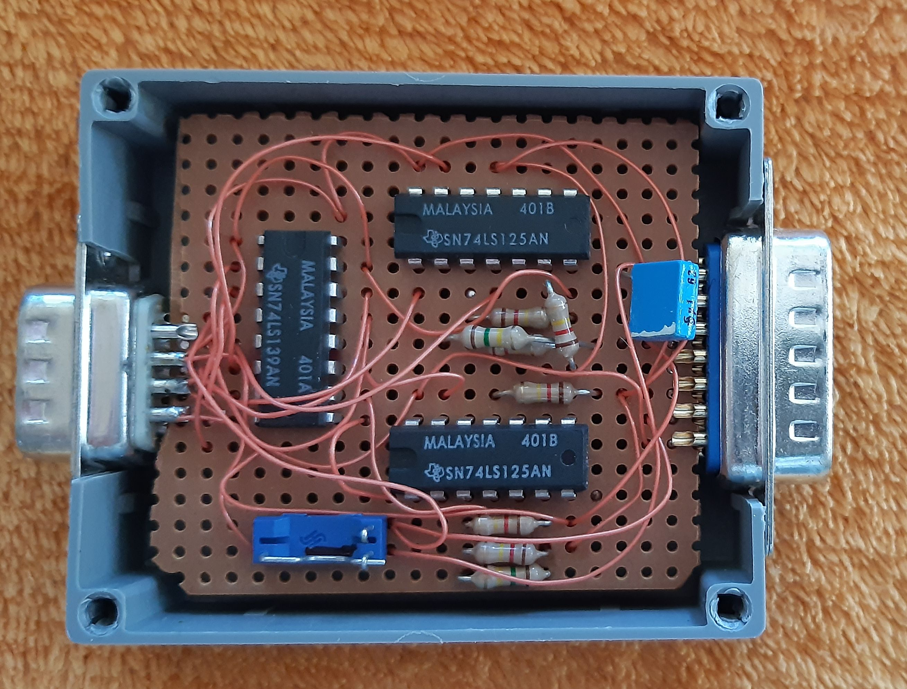
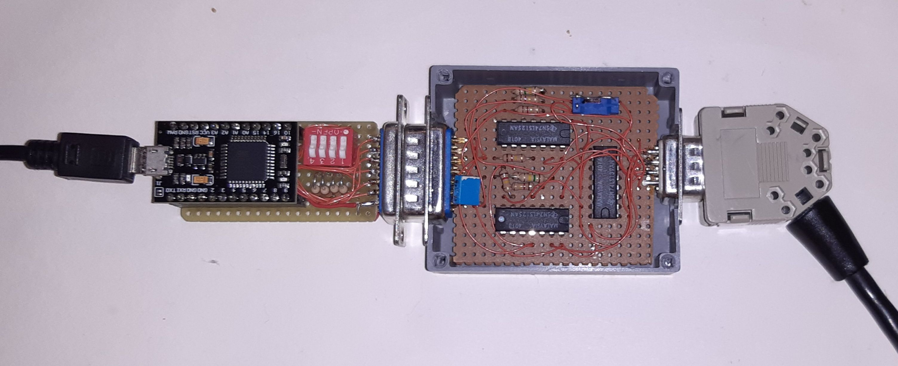
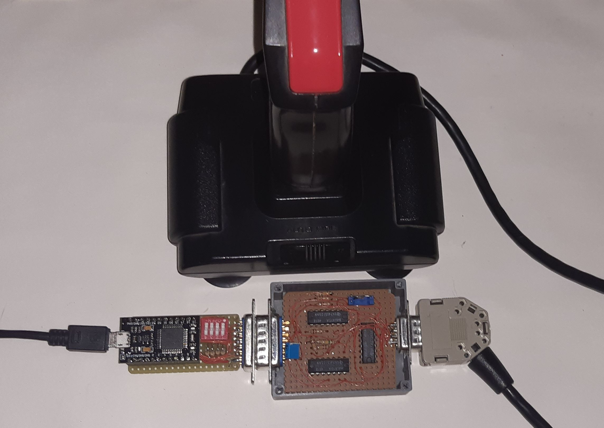

# Joystick-Adapter_9-15

This is a 9 pin Kempston joystick to 15 pin PC GamePort joystick adapter,
I have built this adapter already in 1993, but only now I made a KiCad plan afterwards.

Now you can play old games with an old Kemston joystick (from ZX-Spectrum / C64) via this adapter and your "USB GamePort adapter" under Windows / DOSBox.

