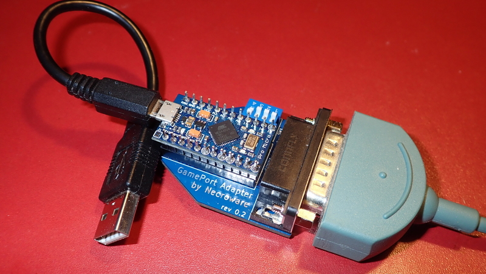

# Necroware's GamePort Adapter

Many people from the retro community still have their beloved joysticks and
gamepads from the early days. This devices often live their lives somewhere in
the dark corners of our basements and we don't dare to throw them away, because
of nostalgic reasons. They remind us so much on our childhood, where we played
our Wing Commanders, X-Wings, Descents and many other games. This old joysticks
were all made to be connected to the game port, usually on a sound card. But
in the end of 90's and beginning of 2000's game ports vanished from our
computers and were replaced by USB and our old joysticks disappeared in the
past. Today not everybody has a full retro PC and many people are using their
modern computer with a DosBox to play the old games. If needed with a modern
USB joystick. But wouldn't it be great to play the old games with the same
joystick, which we used back then? And this is where this adapter comes into
play. It can be used to connect gameport joysticks to an USB port.

## How does it work?

The adapter is built around Arduino Pro Micro, which uses the same ATmega32U4
microcontroller as Leonardo. This microcontroller has built-in USB HID
capabilities and can be used to build HID input devices, like joysticks. The
adapter itself is super simple, the main brainwork was invested into the
software. Very much simplified, it reads the joystick states and sends the data
via the USB to the computer, which in the end thinks, that it communicates with
an USB joystick.

## What is special about this one?

There are already plenty of gameport to USB adapters for basic analog joysticks
and, as far as I know, there were some efforts to communicate with Sidewinder
joysticks by Microsoft as well. But there are no universal adapter, which would
work with different types of joysticks. This adapter implements multiple drivers
for various analog and digital joysticks with an option to add more in the 
future.

Features overview:
* Support for generic analog joysticks with 2/4 buttons and 2/4 axes
* Four switches to select joystick type
* Autodetection for digital Microsoft Sidwinder joysticks
* Auto-Calibration

## What is the difference between analog and digital joystick?

Many people call buttons only joysticks or gamepads as digital. This is kind of
right, because A button is either pressed or not. You can't have an analog
values in between. However by digital in this case we mean something different.
A gameport contains 15-pins, 8 of which are used for joystick communication. 4
pins are for buttons and carry digital values in sense of on/off and 4 pins are
for analog axes, which deliver voltage somewhere between 0V and 5V. Joystick,
which were made in the early days were using this pinout. They could have
maximum of 4 buttons and 4 axes and were DOS compatible. Later, in times of
Windows 95/98 many joysticks were made to be plugged into a gameport as well,
but they were not limited to 4 buttons and 4 axes. They had a lot more exciting
features, like hat switches and throttle controls. But how did this work? Well
the manufacturers implemented their drivers to communicate with the joystick via
gameport using a proprietary communication protocol. For example by using one
pin of the gameport as clock and another one as data, the possibilities were
almost limitless. Such joysticks are called digital as well, because they use
digital protocols to communicate with the PC. And suddenly many features were
possible, but the price of this features was the lost compatibility to DOS. You
couldn't just plug such a joystick it into the gameport and expect it to work in
the old DOS games. The plug was the same, but the signaling was completely
different.

## Which joysticks does this adapter support?

Currently following drivers were implemented. To select the right drivers, you
have to use four switches, as shown in the table. The switches can be changed or
extended in the future, so please pay attention to the updates.

Joystick Model      | Buttons | Axes  |  Hat | SW1-4 | Comments
--------------------|---------|-------|------|-------|-----------------------
Generic Analog      | 2       | 2     | 0    | 0000  | 
Generic Analog      | 4       | 2     | 0    | 1000  | 
Generic Analog      | 4       | 3     | 0    | 0100  | 3rd Axis is throttle
Generic Analog      | 4       | 4     | 0    | 1100  | 
CH FlightStick      | 4       | 4     | 1    | 0010  | Analog, DOS-compatible
ThrustMaster        | 4       | 3     | 1    | 1010  | Analog, DOS-compatible 
Sidewinder GamePad  | 10      | 2     | 0    | 1110  | Digital protocol
Sidewinder 3D Pro   | 8       | 4     | 1    | 1110  | Digital protocol

Please pay attention how the same switches are used for different Sidewinder
devices. This is possible due to fully digital communication. Using this the
adapter implements autodetection as soon as it at least knows, that it has to be
a Sidewinder product. Currently only drivers for two Sidewinder devices were
implemented, since I have no other models at hand.

## Which joysticks were tested?

Well physically following joysticks were tested so far:

* Gravis Analog Pro
* Gravis PC GamePad
* Sidewinder GamePad
* Sidewinder 3D Pro

Those are joysticks, which I had at hand during the development. However,
Sidewinder 3D Pro can be switched between analog and digital mode and in analog
mode it can emulate ThrustMaster and CH FlightStick. That's why you see them in
the table above. Unfortunately I don't possess those joysticks in real, so may
be the implementation is not quite correct with the real ones.

## What is auto calibration?

Old analog joysticks have resistors inside, which is specified to be 100 kOhm.
Unfortunately this resistors are either worn out, bad quality or were wrong from
the beginning. Therefore most of the generic analog joysticks had adjustment
screws to correct the middle point of the joystick. Also many games had
calibration option in the settings to readjust the joystick. With USB and new
digital solutions the calibration was not required anymore and was completely
implemented in the joysticks and/or drivers. So many modern games have no option
to re-calibrate the joystick anymore. Would we try to play such newer games with
an old analog joystick through this adapter, the joystick middle point would be
totally offset. That's why the adapter makes auto calibration internally and
presents already corrected values to the operation system. 

__ATTENTION__: a hard requirement using the analog joysticks is that during the
plugging into the USB port all axes must be in their middle state, because all
the subsequent calibration happens related to the initial state.

## Technical insights into implementation

The code is well documented, so if you are interested in details, just feel free
to take look into the drivers implementation. All the analog joysticks were
actually a straight forward task, but Sidewinder digital protocol was kind of
tough. There are already some implementations of Sidewinder protocol made for
Arduino. However, they are mostly only for Sidewinder GamePad and not really 
universally made. In the end I was heavily inspired by Linux Sidwinder driver
implementation. The code you can see in this project is a complete rewrite, I
just took Linux driver implementation as reference to understand how it works.
Also the Sidewinder patent US#5628686A helped a lot, especially with switching
between digital and analog mode for Sidewinder 3D Pro.

In opposite to the already mentioned Sidewinder for Arduino implementations,
this one doesn't rely on interrupts. This implementation is from the idea very
similar to what Linux driver does. It polls the port and makes a lot of things
simpler due to synchronous process. The biggest problem was, that the Sidwinder
devices send the data incredibly fast with a clock pulse of only 5us.  It was
not possible to use Arduino's digitalRead(...) function for that. It was too
slow with about 2.7us per call on an Arduino Pro Micro with 16MHz.  It simply
made it impossible to poll 5us pulses, with such a slow function. Not talking
about doing something with the data in between. So out of the need an own
implementation came up, which is up to 50% faster and needs only about 1.6us per
call on the same hardware. The custom I/O functions in the end made it possible
to read the data with speed, which a Sidewinder joystick requires. The best is,
that the code is written in pure C++. It is very simple to read and to use.
There are no macros, no assembler or any dirty hacks, just a lot of
optimization.

## Bill of materials (BOM)

The hardware is super simple. To build an adapter you'll need the PCB from this
project and following parts:

Part    | Count | LCSC#   | Comment
--------|-------|---------|------------------------------------------
CONN1   |   1   | C77835  | DB15 female connector
R1..R4  |   4   | C172965 | 100 kOhm resistors
SW1     |   1   | C15781  | DIP-4 switch
U1      |   1   | C72120  | DIP24 Socket (optional)
U1      |   1   | ---     | Arduin Pro Micro (ATmega32U4 16MHz, 5V)

## Known issues

* *Some axes on an analog joystick are offset*

Auto calibration requires all the axes to be in the middle state during the
initialization. Please see the paragraph about auto calibration.

* *Joystick doesn't work*

Make sure, that you are using one of supported joysticks or a joystick which can
work in legacy analog mode

* *Sidewinder is in the list of supported joysticks, but it doesn't work*

In seldom cases some kind of timing issues seem to happen and the adapter can't
get synchronized with the joystick. Unplug it from the USB and after 30 seconds
plug it in again.

* *MicroUSB port on the Arduino is not stable enough*

This can be a problem indeed, since it is very easy to rip off the USB port
from the PCB. May be there will be other solution in the future. To use an 
Arduino Pro Micro was just the cheapest way so far and they all have this
SMD microUSB ports.

## How to help the project?

The best way is to implement more drivers. Since I have only the joysticks
mentioned above, I can't contribute more, than what is currently included.

## Special thanks

I would like to give some special thanks to *Creopard* from the German 
dosreloaded.de community for providing me the mentioned joysticks. Without that
donation this project wouldn't be possible. Especially dealing with Sidewinder
3D Pro was a very exciting task.

## Links
* [Linux Sidewinder Driver](https://github.com/torvalds/linux/blob/master/drivers/input/joystick/sidewinder.c)
* [Sidewinder patent](https://patents.google.com/patent/US5628686A/en)
* [Creopard Retro Site](https://www.creopard.de/)

